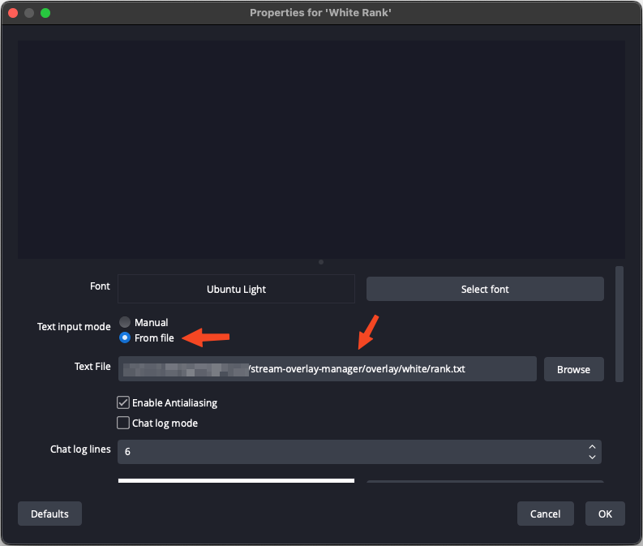

# Stream Overlay Manager
A Streamlit app to edit `.txt` files used in [OBS](https://obsproject.com/de) scenes for commentary on [Go](https://en.wikipedia.org/wiki/Go_(game)).

With this app, you can edit:
- Tournament name
- Black player
    - Name
    - Rank
    - Country image (SVG)
- White player
    - Name
    - Rank
    - Country image
- Commentator names

### Example usage of a `.txt` file in an OBS scene

## Quickstart
1. Clone this repository.
2. Install the dependencies from `requirements.txt`.
3. Add players in `data/players.json`.
4. Add commentators in `data/commentators.json`.
5. Start the application with: `streamlit run main.py`.

### Image Sources
-  [Country Flags](https://github.com/hampusborgos/country-flags)
-  [Baduktv theme](https://github.com/upsided/Upsided-Sabaki-Themes/tree/main/baduktv)
